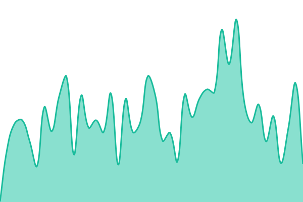
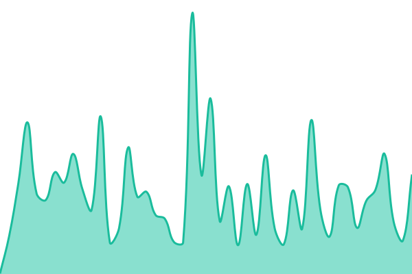
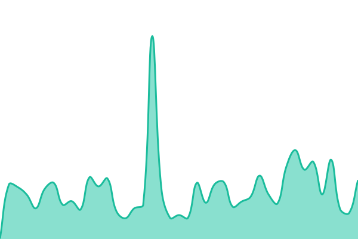
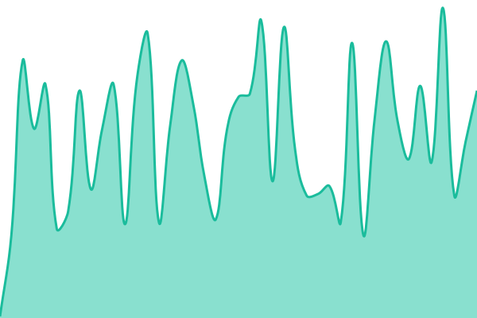
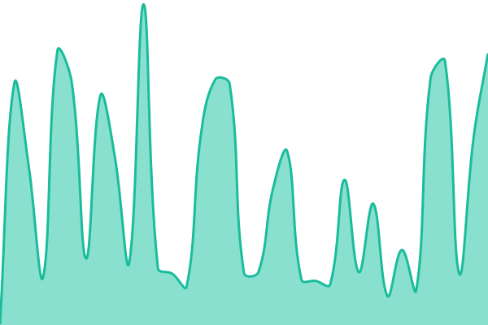
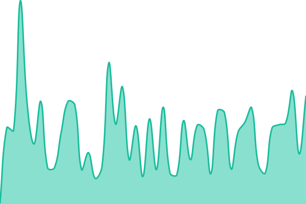
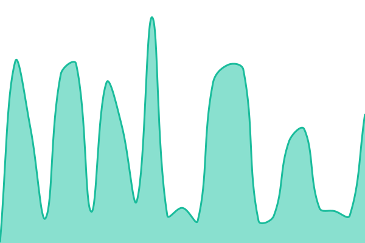
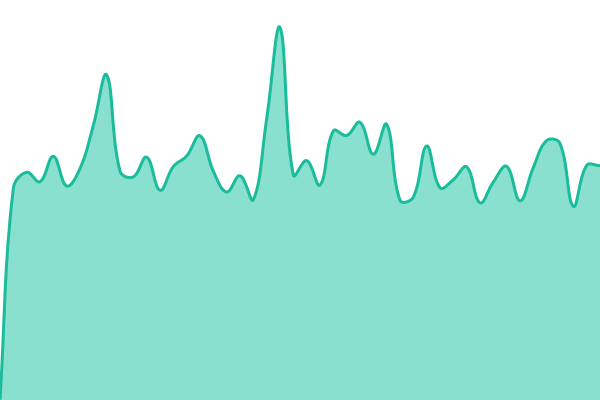
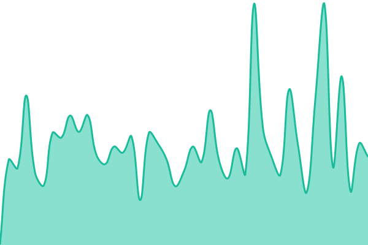

# [📈 Live Status](https://status.seerly.app): <!--live status--> **🟧 Partial outage**

This repository contains the open-source uptime monitor and status page for [Seerly](https://seerly.app), powered by [Upptime](https://github.com/upptime/upptime).

With [Upptime](https://upptime.js.org), you can get your own unlimited and free uptime monitor and status page, powered entirely by a GitHub repository. We use [Issues](https://github.com/Seerly-AI/status/issues) as incident reports, [Actions](https://github.com/Seerly-AI/status/actions) as uptime monitors, and [Pages](https://status.seerly.app) for the status page.

<!--start: status pages-->
<!-- This summary is generated by Upptime (https://github.com/upptime/upptime) -->
<!-- Do not edit this manually, your changes will be overwritten -->
<!-- prettier-ignore -->
| URL | Status | History | Response Time | Uptime |
| --- | ------ | ------- | ------------- | ------ |
|  [Website](https://seerly.app/) | 🟩 Up | [website.yml](https://github.com/Seerly-AI/status/commits/HEAD/history/website.yml) | 

 197ms
     
 | 

<a href="https://status.seerly.app/history/website">100.00%</a>
    

|  [Blog & Content](https://seerly.app/blog) | 🟩 Up | [blog-and-content.yml](https://github.com/Seerly-AI/status/commits/HEAD/history/blog-and-content.yml) | 

 287ms
     
 | 

<a href="https://status.seerly.app/history/blog-and-content">100.00%</a>
    

|  [App / Dashboard](https://seerly.app/login) | 🟩 Up | [app-dashboard.yml](https://github.com/Seerly-AI/status/commits/HEAD/history/app-dashboard.yml) | 

 186ms
     
 | 

<a href="https://status.seerly.app/history/app-dashboard">100.00%</a>
    

|  [Core API](https://seerly.app/api/health) | 🟥 Down | [core-api.yml](https://github.com/Seerly-AI/status/commits/HEAD/history/core-api.yml) | 

 182ms
     
 | 

<a href="https://status.seerly.app/history/core-api">99.99%</a>
    

|  [Database](https://seerly.app/api/health/db) | 🟥 Down | [database.yml](https://github.com/Seerly-AI/status/commits/HEAD/history/database.yml) | 

 212ms
     
 | 

<a href="https://status.seerly.app/history/database">99.99%</a>
    

|  [Background Jobs](https://seerly.app/api/health/queues) | 🟥 Down | [background-jobs.yml](https://github.com/Seerly-AI/status/commits/HEAD/history/background-jobs.yml) | 

 191ms
     
 | 

<a href="https://status.seerly.app/history/background-jobs">99.99%</a>
    

|  [AI Agents](https://seerly.app/api/health/agents) | 🟥 Down | [ai-agents.yml](https://github.com/Seerly-AI/status/commits/HEAD/history/ai-agents.yml) | 

 183ms
     
 | 

<a href="https://status.seerly.app/history/ai-agents">100.00%</a>
    

|  [AI Providers](https://seerly.app/api/health/deps/ai) | 🟩 Up | [ai-providers.yml](https://github.com/Seerly-AI/status/commits/HEAD/history/ai-providers.yml) | 

 319ms
     
 | 

<a href="https://status.seerly.app/history/ai-providers">100.00%</a>
    

|  [Payments](https://seerly.app/api/health/deps/payments) | 🟩 Up | [payments.yml](https://github.com/Seerly-AI/status/commits/HEAD/history/payments.yml) | 

 907ms
     
 | 

<a href="https://status.seerly.app/history/payments">100.00%</a>
    

|  [Email Delivery](https://seerly.app/api/health/deps/email) | 🟩 Up | [email-delivery.yml](https://github.com/Seerly-AI/status/commits/HEAD/history/email-delivery.yml) | 

 295ms
     
 | 

<a href="https://status.seerly.app/history/email-delivery">100.00%</a>
    

<!--end: status pages-->

[**Visit our status website →**](https://status.seerly.app)

## 📄 License

- Powered by: [Upptime](https://github.com/upptime/upptime)
- Code: [MIT](./LICENSE) © [Anand Chowdhary](https://anandchowdhary.com)
- Data in the `./history` directory: [Open Database License](https://opendatacommons.org/licenses/odbl/1-0/)
