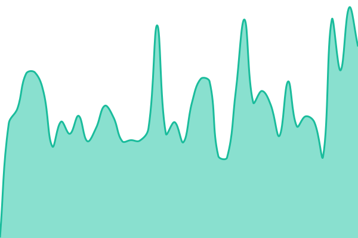
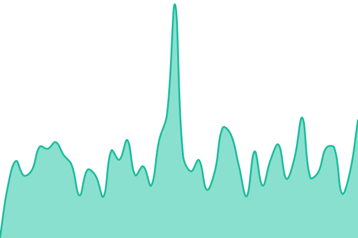

# [📈 Live Status](https://status.seerly.app): <!--live status--> **🟧 Partial outage**

This repository contains the open-source uptime monitor and status page for [Seerly](https://seerly.app), powered by [Upptime](https://github.com/upptime/upptime).

With [Upptime](https://upptime.js.org), you can get your own unlimited and free uptime monitor and status page, powered entirely by a GitHub repository. We use [Issues](https://github.com/Seerly-AI/status/issues) as incident reports, [Actions](https://github.com/Seerly-AI/status/actions) as uptime monitors, and [Pages](https://status.seerly.app) for the status page.

<!--start: status pages-->
<!-- This summary is generated by Upptime (https://github.com/upptime/upptime) -->
<!-- Do not edit this manually, your changes will be overwritten -->
<!-- prettier-ignore -->
| URL | Status | History | Response Time | Uptime |
| --- | ------ | ------- | ------------- | ------ |
|  [Website](https://seerly.app/) | 🟩 Up | [website.yml](https://github.com/Seerly-AI/status/commits/HEAD/history/website.yml) | 

 142ms
     
 | 

<a href="https://status.seerly.app/history/website">100.00%</a>
    

|  [Blog & Content](https://seerly.app/blog) | 🟥 Down | [blog-and-content.yml](https://github.com/Seerly-AI/status/commits/HEAD/history/blog-and-content.yml) | 

 254ms
     
 | 

<a href="https://status.seerly.app/history/blog-and-content">99.95%</a>
    

|  [App / Dashboard](https://seerly.app/login) | 🟥 Down | [app-dashboard.yml](https://github.com/Seerly-AI/status/commits/HEAD/history/app-dashboard.yml) | 

 234ms
     
 | 

<a href="https://status.seerly.app/history/app-dashboard">99.96%</a>
    

|  [Core API](https://seerly.app/api/health/ready) | 🟥 Down | [core-api.yml](https://github.com/Seerly-AI/status/commits/HEAD/history/core-api.yml) | 

 234ms
     
 | 

<a href="https://status.seerly.app/history/core-api">99.97%</a>
    

|  [Background Jobs](https://seerly.app/api/health/queues) | 🟥 Down | [background-jobs.yml](https://github.com/Seerly-AI/status/commits/HEAD/history/background-jobs.yml) | 

 227ms
     
 | 

<a href="https://status.seerly.app/history/background-jobs">99.98%</a>
    

|  [Agent execution](https://seerly-status-proxy.rakesh-menon-account.workers.dev/health/agents) | 🟩 Up | [agent-execution.yml](https://github.com/Seerly-AI/status/commits/HEAD/history/agent-execution.yml) | 

 219ms
     
 | 

<a href="https://status.seerly.app/history/agent-execution">100.00%</a>
    

|  [AI generation](https://seerly.app/api/health/deps/ai) | 🟥 Down | [ai-generation.yml](https://github.com/Seerly-AI/status/commits/HEAD/history/ai-generation.yml) | 

 228ms
     
 | 

<a href="https://status.seerly.app/history/ai-generation">99.99%</a>
    

|  [Payments](https://seerly.app/api/health/deps/payments) | 🟥 Down | [payments.yml](https://github.com/Seerly-AI/status/commits/HEAD/history/payments.yml) | 

 841ms
     
 | 

<a href="https://status.seerly.app/history/payments">99.99%</a>
    

|  [Email Delivery](https://seerly.app/api/health/deps/email) | 🟥 Down | [email-delivery.yml](https://github.com/Seerly-AI/status/commits/HEAD/history/email-delivery.yml) | 

 212ms
     
 | 

<a href="https://status.seerly.app/history/email-delivery">100.00%</a>
    

<!--end: status pages-->

[**Visit our status website →**](https://status.seerly.app)

## 📄 License

- Powered by: [Upptime](https://github.com/upptime/upptime)
- Code: [MIT](./LICENSE) © [Anand Chowdhary](https://anandchowdhary.com)
- Data in the `./history` directory: [Open Database License](https://opendatacommons.org/licenses/odbl/1-0/)
